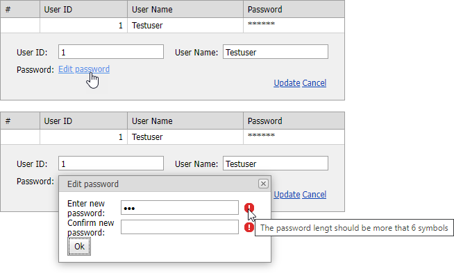

<!-- default badges list -->

<!-- default badges end -->

# Grid View for ASP.NET Web Forms - How to edit a password field
<!-- run online -->
**[[Run Online]](https://codecentral.devexpress.com/e2012/)**
<!-- run online end -->

This example demonstrates one of possible ways to edit a password field.

## Implementation Details

According to the security settings which are implemented in our editors, the password can't be set on the server side. In edit mode, an editor with enabled the [Password](https://docs.devexpress.com/AspNet/DevExpress.Web.ASPxTextBoxBase.Password) property is displayed empty. Since it might confuse users, we suggest you to implement the following functionality to edit a password field.

## Files to Review

* [Default.aspx](./CS/WebSite/Default.aspx) (VB: [Default.aspx](./VB/WebSite/Default.aspx))
* [Default.aspx.cs](./CS/WebSite/Default.aspx.cs) (VB: [Default.aspx.vb](./VB/WebSite/Default.aspx.vb))
